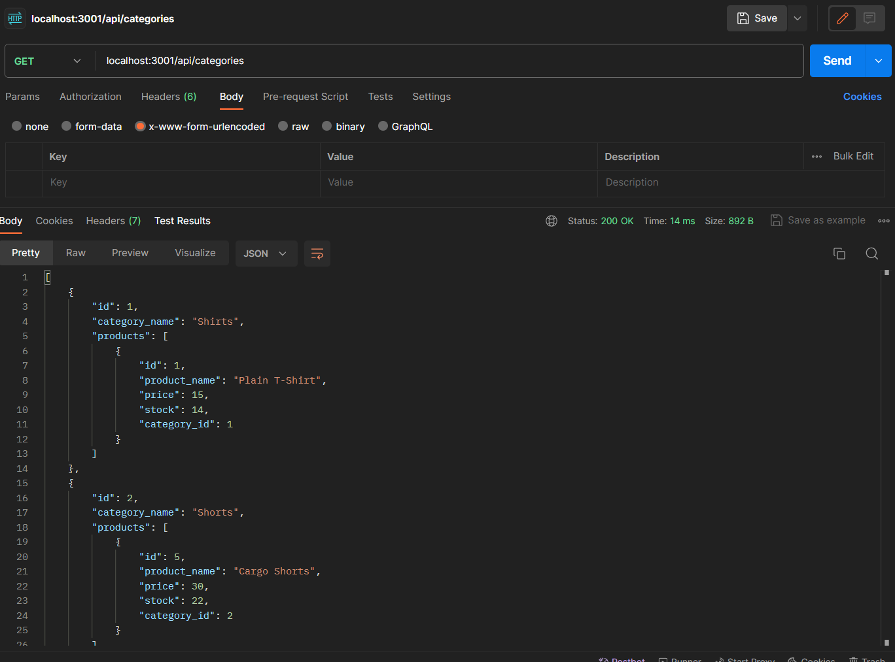

# Retail Data Integration

## Description

As a manager at an internet retail company, I have developed a resilient back end for our e-commerce website utilizing the latest technologies. The primary motivation behind this project was to ensure that our company remains competitive in the fiercely competitive e-commerce industry. This project will help us by staying competitive in the fast paced e-commerce industry. By adopting the latest technologies, our website becomes more appealing to customers. While working on this project I learned how to use the ORM system.

## Table of Contents

- [Installation](#installation)
- [Usage](#usage)
- [Credits](#credits)
- [License](#license)

## Installation

1) Clone the repo: https://github.com/JosueHernand/Retail-Data-Integration
2) Open repo in your code editor
3) Make sure you have nodejs: https://nodejs.org/en/download/current
4) Make sure you have mysql: https://dev.mysql.com/downloads/mysql/
5) Make sure you have postman: https://www.postman.com/
6) Inside termial you will type the following: npm i
    to install all packages required to run the application.

## Usage

1) Make a .env file with your info inside
2) Run the following command: npm run seed
3) npm start

GET routes to return all categories, all products, and all tags [Video Here](https://drive.google.com/file/d/17T02tHkKFC3v7NtuZLrDCfps-5bLmBsE/view)

GET routes to return a single category, a single product, and a single tag [Video Here](https://drive.google.com/file/d/1WgQ4uPx1geVaR3cv36iewEPq_90hQ3mK/view)

POST, PUT, and DELETE routes for categories [Video Here](https://drive.google.com/file/d/1TsoHQw3kYZKiGOQxz4um_FcibpxBnp_F/view)

## Credits

Raymond Bautista: https://github.com/Raymond2811

## License

Using MIT License
